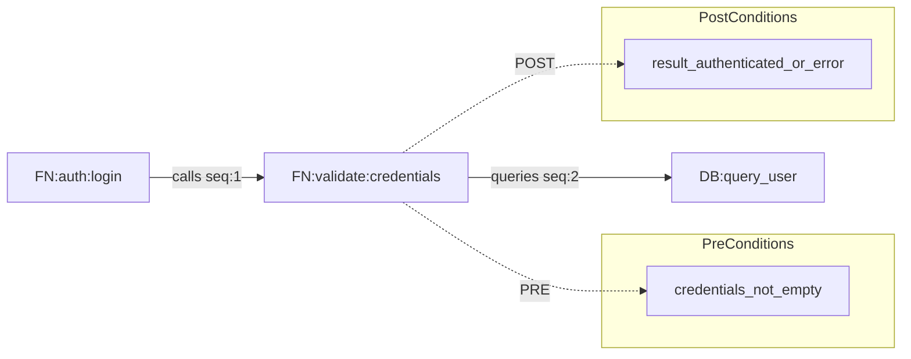

# Логическая схема больших проектов — протокол 3.1

Этот файл — каноничное хранилище результатов протокола 3.1.
Все записи делаются по этапам (C-0, GA-1..GA-5) и по ролям (Концептуализатор, Архитектор, Интегратор, Оркестратор).

## Сквозные правила (концепт → реализация) и анти-имитация (обязательные)
Цель: обеспечить трассируемость решений от концепта до кода и исключить «имитации работы» (заглушки, подмены логики, незаявленные упрощения).

### 0) Что такое «сквозное правило» и где оно живёт
Сквозное правило называется сквозным, потому что:
- Оно фиксируется в каноне концепта и становится обязательным для каждого исполнителя (любой роли) на любой итерации.
- Оно применяется «сквозь» все уровни: концепт → блоки/методы/функции → код → тесты → QA → Evidence.

Каноничное место фиксации сквозных правил: `spec/docs/CONCEPT_MASTER.md` (секция «Сквозные правила»).

### 0.1) Уточнение сквозных правил у Пользователя (обязательное)
На момент создания/уточнения `spec/docs/CONCEPT_MASTER.md` Концептуализатор обязан задать Пользователю наводящие и уточняющие вопросы.
Вопросы должны исходить из логики концепта и покрывать:
- разрешение или категорический запрет методик/техник;
- разрешение или категорический запрет софта/сервисов;
- разрешение или категорический запрет библиотек/фреймворков/зависимостей.

Если Пользователь указывает список запрещённого (методики/техники/софт/библиотеки/подходы) — это становится сквозным правилом немедленно после фиксации в `CONCEPT_MASTER.md`.
Любая реализация/тест/инструментирование, нарушающие сквозные правила, считаются дефектом независимо от того, «работает ли» код.

### 0.2) Обновление канона после выбора решения Пользователем (обязательное)
- Если по итогам proof/math-critique Математик предложил варианты, Пользователь выбрал вариант, а Математик уточнил значения/параметры, эти изменения сначала фиксируются в каноне C-0:
  - `spec/docs/CONCEPT_MATH_PROOF.md` (леммы, ограничения, параметры, коридоры `default/strict/soft`);
  - `spec/docs/CONCEPT_MASTER.md` (обновлённый концепт, применимые ограничения и выбранный вариант).
- Только после синхронизации двух каноничных документов допускается переход в GA-1 или продолжение GA-этапов.
- Запрещено переносить такие обновления в GA-5: GA-5 описывает функции и не изменяет канон концепта.
- Если несинхронность обнаружена уже после начала GA-фаз, Оркестратор обязан открыть `CONSULT`, вернуть процесс в C-0 и зафиксировать обновление канона.
- C-0 работает циклом до стабилизации выбора Пользователя: если после синхронизации (C-0.6) появляется новый выбор/новые параметры, задачи C-0.2..C-0.6 открываются повторно и цикл выполняется заново.
- **Лимит повторных циклов:** допускается не более 3 повторных циклов C-0.2..C-0.6. После 3 циклов параметры фиксируются как «замороженные» (freeze); переход в GA-1 обязателен.
- Переход в GA-1 разрешён только после завершения последнего (актуального) цикла C-0.2..C-0.6 или после срабатывания лимита повторных циклов с заморозкой параметров.

### 0.3) Режим маршрутизации CONSULT перед стартом GA-1 (обязательное)
- После окончательного утверждения концепта и перед первой постановкой задач GA-1 Оркестратор обязан запросить у Пользователя режим:
  - `USER_TRACKING`: Пользователь сам отслеживает прогресс и отвечает на CONSULT напрямую.
  - `YOLO`: каждый CONSULT маршрутизируется Оркестратору.
- Если выбран `YOLO`, режим не активируется сразу:
  - сначала Оркестратор обязан запросить у Пользователя уточнение/расширение сквозных правил;
  - эти дополнительные правила фиксируются как дополнение в `spec/docs/CONCEPT_MASTER.md` (раздел 6);
  - факт активации режима фиксируется в `PHASES/GA-1/WORKLOG.md`.
- После активации `YOLO` каждый новый CONSULT адресуется Оркестратору, а Оркестратор по каждой CONSULT-задаче назначает профильного исполнителя (subagent) и ставит задачу строго в рамках сквозных правил.
- Это правило имеет приоритет над общими формулировками CONSULT в документации: маршрут CONSULT определяется выбранным режимом (`USER_TRACKING` или `YOLO`).

### 1) Трассируемость уровней
- Каждый уровень обязан ссылаться на верхний уровень:
  - `CONCEPT_MASTER.md` и `CONCEPT_MATH_PROOF.md` → блоки (GA-1) → методы (GA-2) → функции (GA-4/GA-5) → реализация кода → тесты → Evidence.
- Для элементов, которые переходят в реализацию, использовать краткие идентификаторы и сохранять их едиными: `BLK:<id>`, `MTD:<id>`, `FN:<id>`.
- Любое утверждение о математике/параметрах в концепте должно иметь опору в `spec/docs/CONCEPT_MATH_PROOF.md` (определение/лемма/теорема/ограничение).

### 2) Запрет заглушек/упрощений/имитаций в реализации (rust-engineer)
Запрещено вносить в ветку разработки:
- Заглушки: `TODO`, `FIXME`, `unimplemented!()`, `todo!()`, `panic!()` вместо логики, фиктивные `Ok(())`/`true`/`0`/пустые структуры, «псевдорезультаты» для прохождения тестов.
- Временные заглушки (в т.ч. «на пару коммитов») и «скелеты» функций без реальной логики.
- Незаявленные упрощения функций и математики: замена алгоритма/формулы на «приблизительно», «на глаз», «потом уточним», «пока так».
- Имитации работы: логика, которая выглядит как вычисление/проверка, но фактически не использует входные данные, не соблюдает инварианты или подменяет критерии.
- **Упрощения методики**: эвристики вместо доказанных методов, приближения вместо точных вычислений, упрощённые формулы без явного разрешения в концепте.

Если необходимо изменить математику/формулу/точность:
- Это делается через обновление `spec/docs/CONCEPT_MATH_PROOF.md` (леммы/ограничения/параметры) и, при необходимости, ADR; изменение в коде без обновления доказательной базы считается нарушением.

### 2.1) Запрет упрощений в тестах (обязательное)
- **Каждый тест обязан тестировать РЕАЛЬНУЮ, ПОЛНОЦЕННУЮ реализацию** функции/метода.
- Запрещены тесты на заглушках, упрощённых версиях, псевдореализациях.
- Запрещены тесты, которые проходят при игнорировании входов, обходе инвариантов, фиктивных возвратах.
- Тест обязан строго соответствовать концепту функции/метода (GA-5) и математическим ограничениям (`CONCEPT_MATH_PROOF.md`).
- QA обязан отклонять (`QA:FAIL`) любые тесты, не соответствующие этому правилу.

### 3) QA на каждой итерации rust-engineer (обязательные гейты)
- На каждой итерации работы rust-engineer (минимальная единица: функция `FN:*`, либо набор функций одного метода `MTD:*`) обязателен прогон QA-проверки.
- Итерация считается принятой только после `QA:PASS` (см. роль `qa-agent` ниже) и наличия Evidence (отчёт QA + тесты).
- QA проверяет не только качество и соответствие критериям, но и отсутствие заглушек/упрощений/имитаций (включая «скрытые заглушки»).
- **QA проверяет соответствие INTEGRATION_MAP.json**: сигнатуры функций, инварианты, ошибки, границы, трассировка к канону.
- **Без трассировки (LINK_ID в doc-комментариях) — QA:FAIL**.

### 4) Роль qa-agent (что именно делает)
- Объект проверки: конкретная итерация rust-engineer (`FN:*` или `MTD:*`), с привязкой к концепту и доказательной базе.
- Минимальные проверки:
  - Соответствие описанию функции (GA-5) и ожидаемым входам/выходам.
  - Соответствие математическим утверждениям и ограничениям из `spec/docs/CONCEPT_MATH_PROOF.md` (если применимо).
  - Соответствие сквозным правилам из `spec/docs/CONCEPT_MASTER.md` (включая запреты на методики/техники/софт/библиотеки).
  - Отсутствие заглушек/упрощений/имитаций (включая «псевдологику», не использующую входы или обходящую инварианты).
  - **Тесты на полноценной реализации**: QA обязан проверять и пропускать только те тесты, которые тестируют **РЕАЛЬНУЮ и ПОЛНОЦЕННУЮ реализацию** каждой функции и каждого метода.
  - **Запрет упрощений методики**: в тестах и коде не должно быть упрощений, эвристик вместо доказанных методов, приближений вместо точных вычислений (если не разрешено явно в концепте).
  - Наличие тестов, которые реально валят заглушки (минимум: негативные/границы/инварианты).
- Артефакт: отчёт `PHASES/<Active>/QA_REPORT.md` (append-only по итерациям) + отметка `QA:PASS|FAIL` в `PHASES/<Active>/WORKLOG.md`.

### 4.1) Мультиязычный fallback при труднорешаемых low-level проблемах (rust-engineer / simd-specialist / debuger / fixer / qa-agent при проверке low-level итераций; для QA при проверке этих ролей)
- Если агент столкнулся с нерешаемой или трудно решаемой проблемой в low-level контексте (`asm`/intrinsics/unsafe C/C++/Rust/FFI/performance), он обязан выполнить дополнительный цикл поиска/рассуждений:
  - сначала на японском (JA);
  - затем на китайском (ZH);
  - затем на английском (EN).
- QA-агент при проверке low-level итераций использует тот же набор JA→ZH→EN для корректной верификации решений, найденных на любом из этих языков.
- Цель цикла: найти решение на другом языке и/или получить более сильный синтез вариантов решения.
- По итогам цикла агент фиксирует:
  - что было проверено на JA/ZH/EN;
  - какие новые гипотезы/решения найдены;
  - какой синтез выбран и почему.
- После нахождения рабочего решения дальнейшие рабочие записи и отчётность ведутся на русском языке (RU).

### 5) SIMD/микроядра гейт (simd-specialist)
- Если итерация затрагивает микроядро/ядро/hot-loop, SIMD/AVX/AVX-512, `asm`/intrinsics, ручной регистровый план, prefetch/alignment — обязателен ревью `simd-specialist` и фиксация Evidence.
- Политика ISA/SIMD (требования, AVX-512 fast-path, fallback и правила выбора) фиксируется как сквозное правило в `spec/docs/CONCEPT_MASTER.md` (раздел 6.4) и обязательна для всех исполнителей.
- Для Zen4 использовать `arch/zen4/zen4_registers.md` как каноничный справочник по регистровому плану/правилам.

## Каноническая структура фазы (обязательная)
- **Purpose:** цель фазы и границы работ.
- **Inputs:** обязательные входы (артефакты/состояния/условия).
- **Outputs/Artifacts:** конечные артефакты и места хранения.
- **Entry Criteria:** условия старта фазы (что должно быть истинно до начала).
- **Exit Criteria:** условия закрытия фазы (что должно быть истинно перед переключением).
- **Evidence:** где фиксируется статус и доказательства выполнения (INDEX/DIGEST/GLOBAL_INDEX).

## Фазовые стандарты (обязательные)
- Шаблон и машиночитаемая структура: `spec/docs/PHASE_SCHEMA.md`.
- Гейт‑чеклист входа/выхода фаз: `spec/docs/PHASE_GATE.md`.

## C-0 — Обобщённый концепт (Концептуализатор)
### Purpose
- Первый этап перед GA-1: собрать и стабилизировать единый концепт.
- Начало C-0: зафиксировать самодостаточное математическое обоснование концепта через леммы/доказательства и использовать его как основу для построения концепта.

### Inputs
- Исходные материалы проекта (тексты, схемы, заметки, ядра/код).
- Базовые контекстные файлы: `.memory/MISSION.md`, `.memory/CONTEXT.md`, `.memory/USECASES.md`.

### Outputs/Artifacts
- `spec/docs/CONCEPT_MATH_PROOF.md` — самодостаточное математическое обоснование концепта с леммами/доказательствами (канон для всех математических утверждений).
- `spec/docs/CONCEPT_MASTER.md` — самодостаточный концепт (математические утверждения обязаны ссылаться на доказательную базу в `CONCEPT_MATH_PROOF.md`).
- `PHASES/C-0/DIGEST.md` — краткий итог фазы.

### Entry Criteria
- Active Phase = `C-0` в `.memory/GLOBAL_INDEX.md`.
- Базовые `.memory/*` файлы созданы и читаются.

### Exit Criteria
- `CONCEPT_MATH_PROOF.md` создан и заполнен: определения, леммы/теоремы, ограничения/диапазоны параметров, корректность ключевых утверждений.
- `CONCEPT_MASTER.md` заполнен (цель, ключевые блоки/роли, последовательность, ограничения) и построен на основе `CONCEPT_MATH_PROOF.md` в части математики.
- После первичной proof-проверки выполнен отдельный критический аудит математического концепта (через `mathematician`): слабые места/неучтённые параметры обозначены, сформированы 2 варианта решения для Пользователя, выбран синтез.
- После выбора Пользователем варианта решения и подбора параметров Математиком обновлены оба каноничных документа: `CONCEPT_MATH_PROOF.md` и `CONCEPT_MASTER.md`.
- Если после C-0.6 Пользователь меняет вариант/параметры, цикл C-0.2..C-0.6 выполняется повторно до актуального синхронизированного состояния канона.
- **Лимит повторных циклов:** допускается не более 3 повторных циклов C-0.2..C-0.6 после первичного завершения C-0.6.
- После 3 повторных циклов параметры фиксируются как «замороженные» (freeze); переход в GA-1 обязателен. Дальнейшие уточнения параметров допускаются только через CONSULT в фазе ARCH с явным разрешением Пользователя.
- Обновление канона зафиксировано в `PHASES/C-0/WORKLOG.md` до перехода в GA-1.
- В `CONCEPT_MASTER.md` указан список первичных материалов.
- Проведена сессия проверки корректности и внесены правки.
- `PHASES/C-0/DIGEST.md` заполнен; `PHASES/C-0/INDEX.md` отмечен как done.

### Notes
- Допускается привлечение Математика для корректности формализаций.
- Приоритет источников: `CONCEPT_MASTER.md` и `CONCEPT_MATH_PROOF.md` — канон; первичные материалы — только для верификации.

## GA-1 — Схема концепта
### Purpose
- Логическая схема концепта: связи, блоки, последовательность логики.

### Inputs
- Заполненный `spec/docs/CONCEPT_MASTER.md`.
- Итог C-0 (DIGEST + статус done).

### Outputs/Artifacts
- Описание схемы в этом разделе (`LOGIC_PROTOCOL.md`).
- `PHASES/GA-1/DIGEST.md`.

### Entry Criteria
- C-0 завершён и отмечен done в `.memory/GLOBAL_INDEX.md`.
- Active Phase = `GA-1` в `.memory/GLOBAL_INDEX.md`.
- Выбран и зафиксирован режим маршрутизации CONSULT (`USER_TRACKING` или `YOLO`) в `spec/docs/CONCEPT_MASTER.md`.
- Для режима `YOLO` до старта GA-1 зафиксированы дополнительные сквозные правила и факт активации режима в `PHASES/GA-1/WORKLOG.md`.

### Exit Criteria
- Зафиксирован перечень блоков, связей и последовательность логики.
- `PHASES/GA-1/DIGEST.md` заполнен; `PHASES/GA-1/INDEX.md` отмечен done.

## GA-2 — Блоки → методы
### Purpose
- Разбить логические блоки на методы.

### Inputs
- Схема GA-1 (список блоков и связей).

### Outputs/Artifacts
- Перечень методов по каждому блоку (фиксируется в `LOGIC_PROTOCOL.md`).
- `PHASES/GA-2/DIGEST.md`.

### Entry Criteria
- GA-1 завершён и отмечен done в `.memory/GLOBAL_INDEX.md`.
- Active Phase = `GA-2` в `.memory/GLOBAL_INDEX.md`.

### Exit Criteria
- Для каждого блока определён набор методов с входами/выходами.
- `PHASES/GA-2/DIGEST.md` заполнен; `PHASES/GA-2/INDEX.md` отмечен done.

### Notes
- Метод — логическая часть блока с целью/результатом, без алгоритмической детализации.
- Строго: 1 блок = 1 сессия одного агента (один агент не обрабатывает два блока одновременно). Разные агенты могут параллельно обрабатывать разные блоки.

## GA-3 — Схемы блоков
### Purpose
- Сформировать отдельную схему на каждый блок.

### Inputs
- Список блоков и методов из GA-2.

### Outputs/Artifacts
- Схемы блоков (фиксируются в `LOGIC_PROTOCOL.md`).
- `PHASES/GA-3/DIGEST.md`.

### Entry Criteria
- GA-2 завершён и отмечен done в `.memory/GLOBAL_INDEX.md`.
- Active Phase = `GA-3` в `.memory/GLOBAL_INDEX.md`.

### Exit Criteria
- Для каждого блока создана схема.
- `PHASES/GA-3/DIGEST.md` заполнен; `PHASES/GA-3/INDEX.md` отмечен done.

## GA-4 — Методы → функции
### Purpose
- Проверить корректность методов относительно концепта и выделить функции.

### Inputs
- Схемы блоков (GA-3) и методы (GA-2).

### Outputs/Artifacts
- Список функций по каждому методу (фиксируется в `LOGIC_PROTOCOL.md`).
- `PHASES/GA-4/DIGEST.md`.

### Entry Criteria
- GA-3 завершён и отмечен done в `.memory/GLOBAL_INDEX.md`.
- Active Phase = `GA-4` в `.memory/GLOBAL_INDEX.md`.

### Exit Criteria
- Для каждого метода сформирован список функций.
- `PHASES/GA-4/DIGEST.md` заполнен; `PHASES/GA-4/INDEX.md` отмечен done.

## GA-5 — Описание функций
### Purpose
- Зафиксировать подробные текстовые описания функций (без кода).
- GA-5 не изменяет канон концепта и не является местом фиксации обновлённых концептуальных параметров.

### Inputs
- Список функций (GA-4).

### Outputs/Artifacts
- Описания функций в иерархии **Блок → Метод → Функции**.
- `PHASES/GA-5/DIGEST.md`.

### Entry Criteria
- GA-4 завершён и отмечен done в `.memory/GLOBAL_INDEX.md`.
- Active Phase = `GA-5` в `.memory/GLOBAL_INDEX.md`.

### Exit Criteria
- Для каждой функции есть описание применения в концепте.
- Соблюдена иерархия хранения (блок → метод → функции).
- Обновления концепта/параметров после math-critique не заносятся в GA-5 (они обязаны быть закрыты в C-0 через `CONCEPT_MASTER.md` + `CONCEPT_MATH_PROOF.md`).
- `PHASES/GA-5/DIGEST.md` заполнен; `PHASES/GA-5/INDEX.md` отмечен done.

## Правило кодирования (rust-engineer)
- Rust‑engineer начинает код проекта только после завершения **INTEGRATOR** (не GA-5!).
- **INTEGRATOR → rust-engineer**: кодирование начинается только после того, как `PHASES/INTEGRATOR/INDEX.md` отмечен `done` в `.memory/GLOBAL_INDEX.md`.
- **До INTEGRATOR** допускаются только спецификации и описания (без реализации кода).
- **Перед реализацией**: rust-engineer обязан читать `PHASES/INTEGRATOR/INTEGRATION_MAP.json` перед реализацией каждой функции.
- **Код должен строго соответствовать JSON-канону**: сигнатуры, инварианты, ошибки, границы.
- **Трассировка в коде**: каждая функция должна иметь doc-комментарий со ссылкой на `LINK_ID` из INTEGRATION_MAP.
- Пример: `/// Ref: LINK:FN:auth→validate:001 | CONCEPT_MASTER.md:3.2`

## Тестирование после функций (по блокам) — жёсткие правила
- Когда блок заполнен методами и для каждого метода функции реализованы в коде: создать тесты на каждую функцию и на методы блока (покрывая все функции внутри блока).
- **Правило полноценной реализации**: каждый тест обязан тестировать **РЕАЛЬНУЮ, ПОЛНОЦЕННУЮ реализацию** каждой функции и каждого метода.
  - Запрещены тесты на заглушках: `todo!()`, `unimplemented!()`, `panic!()` вместо логики.
  - Запрещены тесты на упрощённых реализациях: фиктивные `Ok(())`/`true`/`0`, пустые структуры, псевдокод.
  - Запрещены тесты, которые проходят при игнорировании входов или обходе инвариантов.
- Тесты должны полноценно проверять логику каждой функции и включать перекрёстные проверки, если функции взаимодействуют по логике концепта.
- **Каждый тест строго по концепту**: тест обязан соответствовать описанию функции из GA-5 и математическим ограничениям из `CONCEPT_MATH_PROOF.md`.
- Минимальный формат теста: цель; входы; ожидаемый результат; сценарии (норма/границы/ошибки); зависимости; перекрёстные проверки взаимодействий (если применимо).
- **QA-анти-имитация (обязательно)**: на каждой итерации rust-engineer QA проверяет, что тесты написаны на полноценной реализации, а не на упрощениях/заглушках.
- **Запрет упрощений методики**: нигде в коде и тестах не разрешены упрощения методики, эвристики вместо доказанных методов, приближения вместо точных вычислений (если не разрешено явно в концепте).

## Архитектор — Дополнение плана
### Purpose
- Дополнить план недостающими логическими элементами (структура файлов, вложенность, библиотеки).

### Inputs
- Результаты GA-5 (описания функций).
- `spec/docs/CONCEPT_MASTER.md` (для сверки с концептом).

### Outputs/Artifacts
- Дополнения плана (фиксируются в `LOGIC_PROTOCOL.md` и `PHASES/ARCH/DIGEST.md`).

### Entry Criteria
- GA-5 завершён и отмечен done в `.memory/GLOBAL_INDEX.md`.
- Active Phase = `ARCH` в `.memory/GLOBAL_INDEX.md`.

### Exit Criteria
- Список недостающих элементов зафиксирован и согласован.
- Зафиксирована структура файлов проекта (дерево каталогов, вложенность модулей).
- Зафиксирован список библиотек и зависимостей (с версиями/источниками).
- Зафиксированы контракты между модулями и ABI (если применимо).
- `PHASES/ARCH/DIGEST.md` заполнен; `PHASES/ARCH/INDEX.md` отмечен done.

### Примечание о циклических исправлениях
- Если Интегратор (следующая фаза) обнаруживает несоответствия архитектуры концепту — он оформляет `CONSULT`.
- Оркестратор может назначить возврат на ARCH для исправления (через новую сессию Архитектора).
- **Лимит итераций:** допускается не более 2 циклов INTEGRATOR→ARCH→INTEGRATOR по одному и тому же несоответствию.
- После 2 циклов несоответствие эскалируется на CONSULT к Пользователю с фиксацией решения как окончательного; дальнейшие возвраты на ARCH по тому же вопросу запрещены без явного разрешения Пользователя.

## Интегратор — Связи функций (детерминированный сценарий сборки)
### Purpose
- Создать **единый детерминированный сценарий сборки проекта**, где каждая взаимосвязь описана настолько полно, что код может быть создан только одним способом — как описано Интегратором.
- Определить **жесткую последовательность вызовов, входов, выходов и инвариантов** для каждого блока, метода и функции на основе канона концепта и сквозных правил.
- Обеспечить, чтобы исполнители (rust-engineer и другие) понимали взаимосвязь каждой мелочи, каждого вызова, каждого состояния.

### Inputs
- `spec/docs/CONCEPT_MASTER.md` (включая сквозные правила, раздел 6) — канон концепта.
- `spec/docs/CONCEPT_MATH_PROOF.md` (математика/инварианты/ограничения) — доказательная база.
- Результаты GA-1 (логическая схема блоков и связей).
- Результаты GA-2 (блоки → методы).
- Результаты GA-3 (схемы блоков).
- Результаты GA-4 (методы → функции).
- Результаты GA-5 (описания функций).
- Результаты ARCH (дополнения плана: структура файлов, библиотеки, зависимости).

### Outputs/Artifacts
- **Интеграционная карта взаимосвязей** в трёх форматах (комбинированный подход):
  1. **JSON** (машиночитаемый канон): `PHASES/INTEGRATOR/INTEGRATION_MAP.json` — валидация, парсинг, трассировка.
  2. **Mermaid** (визуализация): `PHASES/INTEGRATOR/INTEGRATION_MAP.mmd` — граф связей, последовательности.
  3. **Markdown-таблицы** (документация): `PHASES/INTEGRATOR/INTEGRATION_MAP.md` — чтение человеком.
- **Последовательный сценарий сборки** (step-by-step: что за чем следует, какие вызовы, какие входы/выходы).
- **Реестр инвариантов и состояний** (что должно быть истинно до/после каждого вызова).
- `PHASES/INTEGRATOR/DIGEST.md` — краткий итог фазы.

### Entry Criteria
- ARCH завершён и отмечен done в `.memory/GLOBAL_INDEX.md`.
- Active Phase = `INTEGRATOR` в `.memory/GLOBAL_INDEX.md`.
- Прочитаны и поняты: файлы концепта, результаты GA-1..GA-5, ARCH, `PHASES/<Active>/DIGEST.md`.

### Exit Criteria
- **Каждая взаимосвязь описана по формату** (см. ниже "Минимальный формат описания взаимосвязи").
- **Последовательность сборки детерминирована**: невозможно создать код иначе, кроме как описано Интегратором.
- **Все инварианты зафиксированы**: состояния до/после вызовов, триггеры, условия, ошибки.
- Несоответствия концепту оформлены как `CONSULT/REFLECT` в `.memory/TASKS.md` и разрешены.
- `PHASES/INTEGRATOR/DIGEST.md` заполнен; `PHASES/INTEGRATOR/INDEX.md` отмечен done.
- `PHASES/INTEGRATOR/INTEGRATION_MAP.md` создан и содержит полную карту взаимосвязей.

### Минимальный формат описания взаимосвязи (обязательный)
Для каждой связи **Блок_A → Блок_B**, **Метод_X → Метод_Y**, **Функция_P → Функция_Q** фиксировать:

| Поле | Описание |
|------|----------|
| **ID связи** | Уникальный идентификатор: `LINK:<BLK|MTD|FN>:<src>→<dst>:<seq>` |
| **Источник** | Блок/метод/функция, которая инициирует вызов |
| **Назначение** | Блок/метод/функция, которая принимается вызов |
| **Тип вызова** | Прямой / обратный / событийный / асинхронный / синхронный |
| **Последовательность** | Порядковый номер в сценарии сборки (строгая последовательность) |
| **Входы (источник)** | Аргументы, контекст, состояние, данные — что передаётся |
| **Входы (назначение)** | Что ожидается на входе (типы, ограничения, инварианты) |
| **Выходы (назначение)** | Возврат, побочные эффекты, изменение состояния — что возвращается |
| **Выходы (источник)** | Что делает источник с результатом (игнорирует / использует / передаёт дальше) |
| **Триггер вызова** | Условие, при котором вызов происходит (событие, состояние, таймер, внешний вход) |
| **Инварианты ДО** | Что должно быть истинно до вызова (предусловия, preconditions) |
| **Инварианты ПОСЛЕ** | Что должно быть истинно после вызова (постусловия, postconditions) |
| **Поток данных** | Куда движутся данные (источник → буфер → обработка → назначение) |
| **Состояния** | Какие состояния меняются, как называются, где хранятся |
| **Ошибки** | Какие ошибки могут возникнуть, как обрабатываются, кто обрабатывает |
| **Граничные условия** | Границы/лимиты/диапазоны, выход за которые = ошибка |
| **Зависимости** | От чего зависит этот вызов (другие вызовы, внешние системы, данные) |
| **Сквозные правила** | Какие запреты/разрешения из `CONCEPT_MASTER.md:6` применяются |

### Комбинированный формат записи взаимосвязей (обязательный)
Каждая взаимосвязь описывается в **трёх форматах** для однозначного понимания нейросетями и людьми:

#### 1. JSON (машиночитаемый канон)
```json
{
  "link_id": "LINK:FN:auth→validate:001",
  "source": { "type": "FN", "id": "FN:auth:login" },
  "target": { "type": "FN", "id": "FN:validate:credentials" },
  "relation_type": "calls",
  "sequence": 1,
  "inputs": {
    "from_source": ["username:string", "password:string"],
    "to_target": ["credentials:CredentialsStruct"]
  },
  "outputs": {
    "from_target": ["valid:bool", "error:Option<String>"],
    "to_source": ["auth_result:AuthResult"]
  },
  "trigger": "user_login_event",
  "invariants_before": ["credentials_not_empty"],
  "invariants_after": ["result_authenticated_or_error"],
  "errors": ["InvalidCredentials", "DatabaseError"],
  "boundaries": {
    "username": {"min": 3, "max": 64},
    "password": {"min": 8, "max": 128}
  },
  "dependencies": ["BLK:database", "MTD:session:create"],
  "canon_ref": {
    "concept": "CONCEPT_MASTER.md:3.2",
    "math": "CONCEPT_MATH_PROOF.md:L2",
    "cross_cutting": ["SEC:001", "PERF:003"]
  }
}
```

#### 2. Mermaid (визуализация графа)


#### 3. Markdown-таблица (документация)
| Поле | Значение |
|------|----------|
| `LINK_ID` | `LINK:FN:auth→validate:001` |
| `SOURCE` | `FN:auth:login` |
| `TARGET` | `FN:validate:credentials` |
| `RELATION` | `calls` |
| `SEQUENCE` | `1` |
| `INPUTS` | `username:string, password:string` |
| `OUTPUTS` | `AuthResult` |
| `TRIGGER` | `user_login_event` |
| `PRE_CONDITIONS` | `credentials_not_empty` |
| `POST_CONDITIONS` | `result_authenticated_or_error` |
| `ERRORS` | `InvalidCredentials, DatabaseError` |
| `CANON_REF` | `CONCEPT_MASTER.md:3.2` |

### Правило единства форматов
- Все три формата **обязательны** для каждой взаимосвязи.
- При расхождении между форматами — **каноничен JSON**.
- Mermaid и Markdown должны быть **автоматически сгенерированы из JSON** (для исключения рассинхронизации).

### Жесткое правило детерминизма
- Если после описания взаимосвязи остаётся **более одного способа** реализовать вызов — описание **недостаточно**.
- Интегратор обязан уточнять описание до тех пор, пока **не останется единственного способа** реализации.
- Это правило гарантирует, что код будет создаваться **сразу в жестко описанных правилах** без интерпретаций.

### Правило трассировки к канону
- Каждая взаимосвязь обязана иметь **явную трассировку к канону**:
  - К какому разделу `CONCEPT_MASTER.md` относится.
  - Какие инварианты из `CONCEPT_MATH_PROOF.md` применяются.
  - Какие сквозные правила (раздел 6) обязательны.
- Если трассировка невозможна — оформить `CONSULT` и остановиться.

## Математический CONSULT (обязателен)
- Все вопросы по формулам, соотношению параметров и математической корректности выносить на `CONSULT` с назначением агента `mathematician`.
- Математик определяет допустимые коридоры параметров исходя из цели проекта.
- Если параметр допускает диапазон, фиксировать три уровня: `default` (средний), `strict` (жёсткий), `soft` (мягкий).
- Каноничное место фиксации доказательной базы: `spec/docs/CONCEPT_MATH_PROOF.md` (леммы/теоремы/ограничения/инварианты).

## Критический аудит математического концепта (обязателен после proof-проверки)
- После того как Концептуализатор получил от Математика proof (леммы/доказательства), обязателен второй запрос к Математику в режиме критика.
- Результат критического аудита обязан содержать:
  - слабые и неучтённые места концепта;
  - неучтённые параметры, ограничения и условия применимости;
  - оценку рисков некорректности.
- Математик обязан предложить минимум 2 варианта решения для Пользователя (с компромиссами/рисками).
- Если Пользователь предлагает собственный метод:
  - метод принимается в рассмотрение;
  - математик-критик обязан отдельно проверить его валидность и ограничения и зафиксировать вердикт.
- Если Пользователь не предлагает метод и просит «найти решение»:
  - математик-критик выполняет поиск/синтез через 5-язычный цикл (RU/EN/ZH/DE/FR).
- После выбора Пользователем варианта/метода обязательно:
  - обновить `spec/docs/CONCEPT_MATH_PROOF.md` (параметры/ограничения/обоснования);
  - обновить `spec/docs/CONCEPT_MASTER.md` (обновлённый концепт и применимые ограничения).
- Только после синхронизации канона допускается переход в GA-1/продолжение GA-фаз; фиксация только в GA-5 считается нарушением протокола.
- Если после синхронизации канона появляется новый вариант/новые параметры от Пользователя, запускать повторный цикл C-0.2..C-0.6 и блокировать GA-фазы до завершения нового цикла.
- После внесения исправлений и принятия решения дальнейшая рабочая фиксация ведётся на русском языке.

## Мультиязычная верификация математики (обязательна для C-0 и всех математических CONSULT)
- Для проверки корректности рассуждений и поиска семантических ошибок применять пять независимых языковых сессий:
  - Сессия A: русский (RU);
  - Сессия B: английский (EN);
  - Сессия C: китайский (ZH).
  - Сессия D: немецкий (DE).
  - Сессия E: французский (FR).
- Минимальный цикл проверки:
  - построить решение/доказательство на RU;
  - независимо повторить доказательство на EN;
  - независимо повторить доказательство на ZH;
  - независимо повторить доказательство на DE;
  - независимо повторить доказательство на FR;
  - сравнить RU/EN/ZH/DE/FR и зафиксировать все расхождения (термины, кванторы, ограничения, граничные условия, параметры).
- Итог принимается только после синтеза (глобальное нахождение корректного решения):
  - либо выбран наиболее корректный вариант с обоснованием;
  - либо сформировано совокупное решение, снимающее разночтения между версиями.
- Если противоречия не сняты — обязательный `CONSULT` по активному режиму маршрутизации (`USER_TRACKING` → Пользователь, `YOLO` → Оркестратор) и остановка перехода к следующему этапу.
- Фиксация результатов:
  - `spec/docs/CONCEPT_MATH_PROOF.md`: раздел multilingual verification (RU/EN/ZH/DE/FR summary + divergences + final synthesis);
  - `.memory/PHASES/<Active>/WORKLOG.md`: факт прохождения 5-сессионной проверки и ссылка на итог.

## Harness-протокол правок (обязателен для реализации и редактирования документов)
- Канон протокола правок: `spec/docs/EDIT_HARNESS.md`.
- Перед правкой обязателен `read_range` (`scripts/harness_read.ps1`) с фиксацией `range_hash`.
- Любая операция правки выполняется через `scripts/harness_apply.ps1` и включает `expected_hash`.
- При несовпадении хеша (`stale edit`) правка отклоняется: перечитать диапазон, пересобрать правку; при конфликте — `CONSULT`.
- «Слепые» текстовые замены без hash-check запрещены.
- QA обязан проверять evidence применения harness-протокола для каждой итерации с файловыми правками.

## Оркестратор — Назначения
### Purpose
- Вести реестр назначений субагентов: объект работы, ID сессии, статус.

### Inputs
- Результаты фазы INTEGRATOR и список необходимых корректировок.

### Outputs/Artifacts
- Реестр назначений в этом файле и `PHASES/ORCHESTRATOR/DIGEST.md`.

### Entry Criteria
- INTEGRATOR завершён и отмечен done в `.memory/GLOBAL_INDEX.md`.
- Active Phase = `ORCHESTRATOR` в `.memory/GLOBAL_INDEX.md`.

### Exit Criteria
- Все назначения и объекты работ зафиксированы.
- `PHASES/ORCHESTRATOR/DIGEST.md` заполнен; `PHASES/ORCHESTRATOR/INDEX.md` отмечен done.

## Контекст-брииф (Digest)
- Каждый этап завершает краткий `PHASES/<Phase>/DIGEST.md` (1–2 страницы).
- Перед началом любой сессии Агент обязан прочитать `PHASES/<Active>/DIGEST.md` и использовать его как основной контекст.
- Если digest отсутствует или устарел — инициировать `CONSULT` и остановиться до обновления.

## Протокол изменений LOGIC_PROTOCOL
- Любые изменения `LOGIC_PROTOCOL.md` оформлять ADR в `spec/adr/ADR-XXXX.md`.
- После ADR обновлять `.memory/DECISIONS.md` и при необходимости `.memory/INDEX.yaml`.

## Политика компактности LOGIC_PROTOCOL
- Этот файл содержит только канон и итоговые своды по этапам.
- Детальные расчёты, длинные обоснования и черновики фиксируются в `PHASES/<Active>/WORKLOG*.md` или `spec/docs/*`.
- При форсмажоре восстановление: `STATE.md` → `GLOBAL_INDEX.md` → `PHASES/<Active>/DIGEST.md` → (при необходимости) `PHASES/<Active>/WORKLOG*.md`.

## Сквозной контроль агенты
- Все agent\subagent обязаны выполнять системный автоцикл и сквозные правила протокола 3.1.
- Любые отклонения фиксируются как `CONSULT` в `.memory/TASKS.md`.
- Оркестратор ведёт контроль соответствия и назначений в этом файле.

### Реестр соответствия агенты
| agent\subagent | автоцикл | протокол 3.1 |
|---|---|---|
| global-architect | required | required |
| orchestrator | required | required |
| architect | required | required |
| integrator-runtime | required | required |
| debuger | required | required |
| fixer | required | required |
| tester | required | required |
| qa-agent | required | required |
| mathematician | required | required |
| conceptualizer | required | required |
| rust-engineer | required | required |
| simd-specialist | required | required |

## Оркестратор — Назначения

### Текущий этап протокола 3.1: C-0 (обобщённый концепт)
- Дата: 2026-01-29
- Статус: активна сессия 1 (сбор и синтез)

### Реестр назначений субагентов
| ID сессии | Агент | объект работы | статус | дата назначения | примечания |
|-----------|-------|---------------|--------|-----------------|------------|
| — | — | — | — | — | — |

## Соответствие фаз протокола
- C-0 ↔ `.memory/PHASES/C-0`
- GA-1..GA-5 ↔ `.memory/PHASES/GA-1..GA-5`
- Архитектор ↔ `.memory/PHASES/ARCH`
- Интегратор ↔ `.memory/PHASES/INTEGRATOR`
- Оркестратор ↔ `.memory/PHASES/ORCHESTRATOR`
